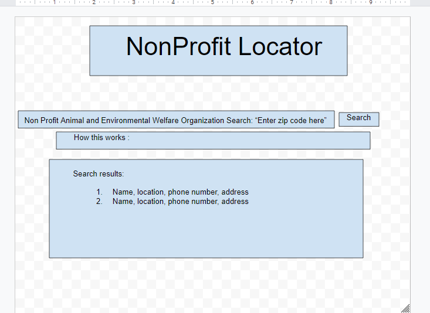

## Project title
Nonprofit Locator for Animals and Environment

## Project description
This app will allow people who want to donate to local animal and environmental welfare projects to locate nonprofits near them using specific search criteria. The search criteria will be run through API’s and will give them welfare organizations as well as locations of these nonprofits. 

## User story
AS A person living in the USA who does not know the local nonprofits in my area that serve the environment and animals.

I WANT to see which nonprofits in my area serve the animals and environment.

SO THAT I can donate to a local nonprofit relating to the environment and animals.

## Wireframe or sketch of the design

## APIs to be used
- https://projects.propublica.org/nonprofits/api
- https://wiki.openstreetmap.org/wiki/API_v0.6

## Rough breakdown of tasks

- Create HTML layout
	- Will include
		- Search bar
		- Zip code field
		- Nav bar
		- About section

- Styling

- Fetch function

- Function to display results (addresses etc) as strings for user

- Function to save prior search results via local storage?
